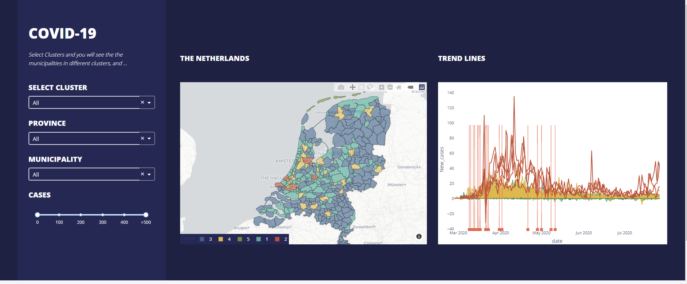

# Abstract

The main theme of this case study was to analyze the features that contributed to the spread of the coronavirus in the Netherlands. We analyzed different open source data such as demographics, mobility, employment, income, etc with the cases count.

# Methodology
- Preprocessing the data
- Reducing the features using PCA
- Clustering the cities using Hierarchical clustering
- Selecting the features using Decision trees with No.of cases as the dependent variable

# Dashboard
To display the results we created a dashboard using plotly and dash

